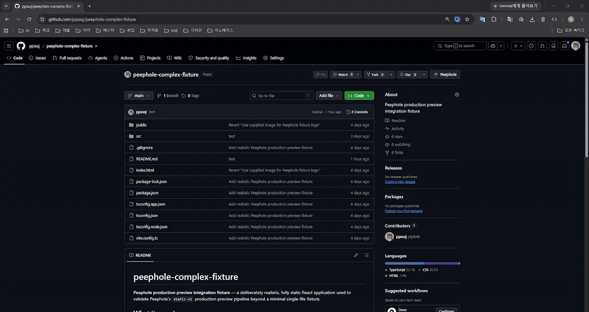
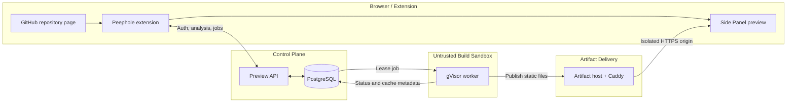

<p align="center">
  
</p>

<h1 align="center">Peephole</h1>

<p align="center">
  <a href="./README.md">English</a> | 한국어
</p>

<p align="center">
  <strong>GitHub 저장소를 클론하기 전에 먼저 확인하세요.</strong>
</p>

<p align="center">
  <a href="https://chromewebstore.google.com/detail/peephole/fieofkhijgngfoflgpkbghbkaidhdgel">Chrome Web Store에서 Peephole 0.1.0 설치</a>
</p>

<p align="center">
  <sub>Chrome Web Store에 현재 게시된 버전은 0.1.0입니다. Peephole <a href="https://github.com/The-peephole/peephole/releases/tag/v0.2.0">v0.2.0은 GitHub에 릴리스</a>되었고 Chrome Web Store 심사를 위해 제출된 상태이며, 아직 Store에서는 설치할 수 없습니다. 자세한 내용은 <a href="docs/RELEASE_V0.2.0.md">v0.2.0 릴리스 기록</a>을 참고하세요.</sub>
</p>

<p align="center">
  Peephole은 지원되는 공개 저장소를 분석하고, 조건을 만족하는 정적 프론트엔드를 격리된 프로덕션 샌드박스에서 빌드한 뒤, 그 결과물(HTTPS 아티팩트)을 Chrome 사이드 패널에 보여 줍니다.
</p>

<p align="center">
  <a href="https://github.com/The-peephole/peephole/actions/workflows/ci.yml">
    
  </a>
</p>

<p align="center">
  
</p>

<p align="center">
  <em>저장소를 분석하고, 정확한 커밋을 격리된 gVisor 샌드박스에서 빌드한 뒤, 결과를 GitHub 화면에서 바로 미리 확인합니다.</em>
</p>

## 왜 Peephole인가?

프론트엔드 저장소를 파악하려면 보통 클론부터 하고, `package.json`을 살펴보고, 의존성을 설치하고, 맞는 실행 명령을 찾은 다음에야 비밀 값이나 백엔드, 지원되지 않는 도구가 필요하다는 사실을 알게 됩니다.

Peephole은 먼저 범위가 제한된 저장소 분석을 수행합니다. 프레임워크, 패키지 매니저, 빌드 계획, 미리보기 가능 여부, 그리고 차단 요인과 경고를 찾아냅니다. 지원되는 정적 미리보기 계약을 만족하는 저장소만 격리 빌드로 넘어가고, 나머지는 이유를 명확히 설명한 채 분석 단계에서 멈춥니다.

## 기능

| 기능               | 하는 일                                                                                                                                |
| ------------------ | -------------------------------------------------------------------------------------------------------------------------------------- |
| 저장소 분석        | 알려진 저장소 파일을 바탕으로 프레임워크, 패키지 매니저, 빌드 계획, 차단 요인, 경고를 탐지합니다.                                      |
| 저장소 구조 탐지   | 저장소 레이아웃과 범위가 제한된 프로젝트 후보를 보여 줍니다. 프론트엔드를 명시적으로 선택하면 빌드 전에 해당 대상만 별도로 분석합니다. |
| 브랜치 선택        | 범위가 제한된 목록에서 원하는 브랜치를 고를 수 있으며, 선택한 브랜치는 분석 전에 정확한 커밋 SHA로 해석됩니다.                         |
| 커밋 고정 미리보기 | 바뀔 수 있는 브랜치 끝을 신뢰하지 않고, 정확한 Git 커밋을 해석해 빌드합니다.                                                           |
| 명확한 지원 여부   | 실행 전에 미리보기 가능한 저장소와 지원되지 않는 프로젝트를 구분합니다.                                                                |
| GitHub 인증        | GitHub App OAuth를 사용하며, 확장 프로그램은 수명이 짧은 Peephole 세션만 저장합니다.                                                   |
| GitHub 테마 연동   | 저장소 페이지의 Peephole 버튼과 사이드 패널 모두 현재 GitHub Light, Dark, Dark Dimmed 또는 호환되는 Primer 시맨틱 테마에 맞춰집니다.   |
| 격리 빌드          | 신뢰할 수 없는 설치·빌드 작업을 gVisor 안에서 non-root 사용자로, 리소스와 네트워크를 제한한 채 실행합니다.                             |
| 사이드 패널 표시   | 정적 결과물을 격리된 HTTPS 오리진으로 게시하고 Chrome 사이드 패널에 표시합니다.                                                        |

## 동작 방식

1. 공개 GitHub 저장소를 엽니다.
2. 저장소 페이지에서 Peephole을 엽니다.
3. 탐지된 스택, 빌드 계획, 차단 요인, 미리보기 가능 여부를 확인합니다.
4. 지원되는 저장소라면 GitHub를 연결하고 미리보기 빌드를 시작합니다.
5. Peephole이 정확한 커밋을 검증한 뒤 격리된 gVisor 샌드박스 안에서 빌드합니다.
6. 생성된 정적 앱이 HTTPS로 사이드 패널에 표시됩니다.

## 아키텍처



확장 프로그램은 제어와 화면 표시만 담당하며, 저장소 소스 코드는 신뢰할 수 없는 빌드 경계 안에서만 실행됩니다. 작업이 워커에 도달하기 전에 서버가 저장소 식별 정보, 커밋, 빌드 가능 여부를 독립적으로 검증합니다.

## 보안 모델

**지원된다는 것이 신뢰한다는 뜻은 아닙니다.** Peephole은 모든 저장소와 의존성 라이프사이클 스크립트를 신뢰할 수 없는 입력으로 취급합니다.

- 저장소 소스 코드는 확장 프로그램 안에서 절대 실행되지 않습니다.
- 미리보기 작업은 정확한 Git 커밋에 고정됩니다.
- 설치와 빌드 명령은 실제 gVisor 안에서 non-root 사용자로 실행됩니다.
- 게스트 루트 파일 시스템은 읽기 전용이며, 작업 공간은 loop 장치 기반 ext4로 용량이 엄격히 제한됩니다.
- 작업마다 CPU, 메모리, 프로세스 수, 임시 저장 공간, 실행 시간(wall-clock)에 상한이 있습니다.
- 빌드 단계에서는 네트워크가 비활성화되고, 설치 단계에서는 사설망, 링크 로컬, 메타데이터, 호스트, 다른 작업으로의 접근이 차단됩니다.
- 미리보기 아티팩트는 확장 프로그램이나 컨트롤 플레인 권한이 없는 격리된 오리진에서 제공됩니다.
- 디스크, 네트워크, 샌드박스의 소유 관계는 영속적으로 기록되며, 크래시 후에는 이를 기준으로 대조·정리됩니다.

구현 세부 사항과 남아 있는 위험은 [Preview runtime](docs/PREVIEW_RUNTIME.md), [Sandbox disk security](docs/SANDBOX_DISK_SECURITY.md), [Sandbox network security](docs/SANDBOX_NETWORK_SECURITY.md) 문서에 정리되어 있습니다.

## 현재 검증 현황

Peephole의 정적 미리보기 프로덕션 경로는 AWS EC2 Ubuntu에서 운영되며, Chrome 확장 프로그램을 통해 처음부터 끝까지(E2E) 검증되었습니다. 아래 항목은 특정 환경에서 기록된 검증 결과이며, 문서만 바뀌었다고 해서 다시 확인된 것은 아닙니다.

| 검증 항목                                       | 기록된 결과                                                                                                                                                                  |
| ----------------------------------------------- | ---------------------------------------------------------------------------------------------------------------------------------------------------------------------------- |
| GitHub App 인증                                 | OAuth, PKCE, 서명된 state, 허용된 `chromiumapp.org` 리디렉션, Peephole 세션 발급을 E2E로 검증                                                                                |
| 실제 gVisor 샌드박스 회귀 테스트                | 프로덕션과 유사한 Linux 호스트에서 통과                                                                                                                                      |
| 실제 gVisor 골든 패스                           | 실제 `npm ci`와 Vite/esbuild로 통과                                                                                                                                          |
| 아티팩트 전달                                   | HTTPS 게시와 Chrome 사이드 패널 표시 검증                                                                                                                                    |
| 크래시 복구                                     | `SIGKILL`, systemd 재시작, 큐 복구, 시작 시 runsc/디스크/네트워크 정리 검증                                                                                                  |
| 최종 리소스 잔여물                              | runsc 컨테이너, 네임스페이스, veth, 방화벽 규칙, 마운트, loop 장치, lease, 작업 파일이 남지 않음                                                                             |
| 캐시 무효화                                     | 러너 보안 변경 후 `runnerVersion: "production-2"`로 예상대로 새 빌드가 강제됨                                                                                                |
| Portable CI                                     | 포맷, 린트, 타입 검사, portable 테스트, 확장 프로그램 빌드를 CI에서 강제                                                                                                     |
| PostgreSQL 통합 테스트                          | 통과                                                                                                                                                                         |
| 실제 gVisor `backend-v1` 런타임 (M9)            | 프로덕션 호스트에서 readiness, `/api/hello`, 외부 접근 차단(공용 인터넷/메타데이터/사설망/링크 로컬/호스트/다른 작업), default route 없음, 런타임 NAT 없음, 멱등 정리를 검증 |
| `fullstack-v1` 프론트엔드 ↔ 백엔드 라우팅 (M9)  | 인증된 미리보기가 `ready`에 도달했고, HTTPS 오리진이 프론트엔드를 제공하며 `/api/hello`를 실제 백엔드로 라우팅                                                               |
| 재시작 시 `fail-closed` (M9)                    | 미리보기가 `ready`인 상태에서 `peephole`을 재시작하면 해당 미리보기가 무효화되고(안전한 쪽으로 실패) runsc/네트워크 잔여물이 남지 않음. 백엔드 접속 정보는 재구성되지 않음   |
| GitHub 업스트림 가용성 / 요청 한도 (PR #22, M9) | 서버 소유 `PEEPHOLE_GITHUB_TOKEN`을 설정해, 자격 증명을 출력하지 않고 시간당 5000회(인증 없이는 60회)로 늘어난 것을 확인                                                     |

위의 M9 항목 네 개는 Chrome 확장 프로그램이 아니라 프로덕션 API와 호스트에 직접 대고 검증한 결과입니다(`backend-v1`/`fullstack-v1`용 확장 프로그램 UI는 아직 없습니다). 환경 의존적인 실제 gVisor 테스트는 프로덕션과 유사한 Linux 호스트에서 별도로 실행하며, 의도적으로 portable CI에 포함하지 않습니다.

`main`에서 수동 실행한 [`Real golden-path build tests`](https://github.com/The-peephole/peephole/actions/runs/35069679620) 워크플로가 현재 퍼스트파티 픽스처로 머지 커밋 `dba47191bdd3600b3f451945653efab2363028c2`에서 성공했습니다. 이 워크플로는 실제 네트워크를 사용하는 CI이며, [Production smoke verification](docs/PRODUCTION_SMOKE.md)에 설명된 운영자 수행 프로덕션 스모크 테스트와는 다릅니다.

## 지원 프로젝트

| 수준                                        | 현재 범위                                                                                                                                                                                                                                                                                                                                                                                                                                                                                                                                                                                           |
| ------------------------------------------- | --------------------------------------------------------------------------------------------------------------------------------------------------------------------------------------------------------------------------------------------------------------------------------------------------------------------------------------------------------------------------------------------------------------------------------------------------------------------------------------------------------------------------------------------------------------------------------------------------- |
| 프로덕션 실행                               | 저장소 루트의 정적 HTML, 그리고 npm과 대상 디렉터리 자체의 `package-lock.json`을 사용하는 루트 또는 명시적으로 선택한 하위 Vite + React 대상                                                                                                                                                                                                                                                                                                                                                                                                                                                        |
| 분석만 지원                                 | Vue/Svelte Vite, 다른 패키지 매니저, 백엔드 단서, 모노레포 모호성. 실행 가능한 계획을 만들지 않습니다.                                                                                                                                                                                                                                                                                                                                                                                                                                                                                              |
| 기존 배포 처리                              | 범위가 제한된 GitHub Deployments API 조회로, 확인된 실제 배포(있는 경우)를 저장소가 선언한 홈페이지와 구분해 외부 링크로 보여 줍니다. 둘 다 임베드하거나 접속을 시험하거나 프록시하지 않습니다.                                                                                                                                                                                                                                                                                                                                                                                                     |
| 브랜치 선택                                 | 범위가 제한된 목록(최대 100개)에서 브랜치를 선택할 수 있으며, 분석·빌드 계획·미리보기 작업 생성 전에 정확한 커밋 SHA로 해석됩니다.                                                                                                                                                                                                                                                                                                                                                                                                                                                                  |
| 저장소 구조 탐지                            | 레이아웃과 범위가 제한된 프로젝트 후보 경로를 보고합니다. 탐지된 프론트엔드 후보를 명시적으로 선택하면 정확한 SHA 기준으로 별도 대상 분석을 수행합니다.                                                                                                                                                                                                                                                                                                                                                                                                                                             |
| 백엔드 탐지                                 | 루트와 하위 후보에 대해 범위가 제한된 읽기 전용 근거(프레임워크, 데이터베이스 의존성, 검증되지 않은 엔트리포인트)를 보여 줍니다. 실행 지원 여부와 관계없이 미리보기 대상으로는 제공하지 않습니다.                                                                                                                                                                                                                                                                                                                                                                                                   |
| 환경변수 요구사항 분석                      | `.env.example` 계열 파일에 선언된 변수 *이름*만(값은 보지 않음) auto-configurable/preview-generated/database/external-routing/user-required/unknown으로 분류합니다. 분석 단계에서는 값을 생성하거나 주입하거나 요청하지 않습니다. 좁은 `preview-generated-candidate` 분류의 값 생성은 분석 중이 아니라 나중에 `backend-v1`/`fullstack-v1` 런타임을 만들 때 별도로 이루어집니다(아래 M10 항목 참고).                                                                                                                                                                                                 |
| 백엔드 실행 (`backend-v1`)                  | 좁은 범위의 Express + npm 런타임이 구현되어 프로덕션에 연결되었고 실제 gVisor로 검증되었습니다. 확장 프로그램 UI는 기본적으로 비활성화되어 있어(Build Preview 옵션 없음) 사용할 수 없으며, 런타임 리소스 자체에는 공개 URL이 부여되지 않습니다.                                                                                                                                                                                                                                                                                                                                                     |
| 프론트엔드 ↔ 백엔드 라우팅 (`fullstack-v1`) | 구현 및 프로덕션 검증 완료. 별도 리소스가 `backend-v1` 런타임 하나와 정적 빌드 하나를 하나의 동일 오리진 HTTPS 미리보기로 묶고, `/api`/`/api/*`만 백엔드로 라우팅합니다. 아직 확장 프로그램의 Build Preview 옵션으로는 제공되지 않습니다.                                                                                                                                                                                                                                                                                                                                                           |
| 임시 생성 비밀 값 (M10)                     | 구현 및 프로덕션 검증 완료(2026-09-28). 같은 좁은 `backend-v1`/`fullstack-v1` 계약 안에서, Peephole은 서버 전용 이름 정확히 네 개(`JWT_SECRET`, `SESSION_SECRET`, `COOKIE_SECRET`, `CSRF_SECRET`)에 한해 값을 *생성*해 주입할 수 있습니다. 값은 OCI `process.env`/`config.json` 경로가 아니라 tmpfs 기반 bind mount와 신뢰된 bootstrap으로 전달됩니다. 아직 확장 프로그램의 Build Preview 옵션으로는 제공되지 않습니다.                                                                                                                                                                             |
| 임시 PostgreSQL (M11)                       | 구현 및 프로덕션 검증 완료(2026-10-07). `express-node-npm-v1` 백엔드가 정확히 `pg`와 `DATABASE_URL`만 선언한 신뢰된 `fullstack-v1` 미리보기에 대해, Peephole은 별도의 호스트 로컬 테넌트 클러스터에 임시 PostgreSQL 데이터베이스와 `pv_*` 역할을 하나씩 만듭니다. `DATABASE_URL`은 전용 tmpfs 파일로 전달되며(OCI `process.env`는 사용하지 않음), 네트워크 접근은 그 데이터베이스 엔드포인트 하나로만 허용되고, 중지 시나 크래시 후에는 데이터베이스와 역할을 회수합니다. 독립 `backend-v1`의 데이터베이스 요청은 계속 거부됩니다. 아직 확장 프로그램의 Build Preview 옵션으로는 제공되지 않습니다. |
| 사용자 제공 설정값 (M12)                    | 서버·확장 프로그램 플래그(기본 OFF) 뒤에 코드로 구현됨. 배포되지 않았고 실제 gVisor 호스트 검증 전입니다. 저장소가 선언한 비민감 이름만(비밀 값·API 키 제외), 신뢰된 `fullstack-v1`에서만 지원합니다. docs/USER_PROVIDED_ENVIRONMENT.md 참고                                                                                                                                                                                                                                                                                                                                                        |
| 미구현                                      | 공유 루트 워크스페이스 오케스트레이션, 위의 좁은 형태를 벗어난 모든 백엔드, 임의 또는 사용자 제공 비밀 값 설정(외부 API 키 포함), PostgreSQL + `pg` + `DATABASE_URL` 이외의 모든 데이터베이스 엔진/클라이언트/변수, 사용자 제공 데이터베이스 자격 증명, 비공개 저장소, 임의의 Dockerfile/언어                                                                                                                                                                                                                                                                                                       |

분석 지원 범위는 프로덕션 실행 지원 범위보다 넓습니다. 공식 Vite + React 골든 패스는 [`The-peephole/peephole-fixture-vite-react`](https://github.com/The-peephole/peephole-fixture-vite-react)의 커밋 `4a2c3b78e15d90865ed565c3d38c4045b5a5235f`(저장소 id `1371620276`)입니다.

별도의 [`peephole-fixture-fullstack`](https://github.com/The-peephole/peephole-fixture-fullstack) 커밋 `eae411a288b212201933cebb206126dd5bb0d93e`는 범위가 제한된 프론트엔드 전용 하위 대상 경로를 증명합니다. 이 저장소의 `frontend` 디렉터리는 일반(정적 전용) Build Preview로 독립 설치·빌드할 수 있고, 이 경로에서 `backend` 디렉터리(Express, npm, `/health`·`/api/hello` 라우트)는 시작되지도 라우팅되지도 않으므로, 일반 Build Preview에서 렌더링된 `/api/hello` 요청은 설계상 실패합니다.

같은 `backend` 디렉터리는 별도의 `backend-v1`/`fullstack-v1` 프로덕션 계약용 고정 픽스처이기도 하며([Preview runtime](docs/PREVIEW_RUNTIME.md) 참고), 그 경로에서는 프로덕션 검증이 끝났습니다. `fullstack-v1` 미리보기로 만들면 `/api/hello`가 실제 `backend-v1` 런타임으로 연결되지만, 이는 프론트엔드 Build Preview와는 다른 리소스이며 아직 확장 프로그램 UI에서 제공되지 않습니다.

## 로컬 개발

Node.js 24와 npm으로 의존성을 설치합니다.

```bash
npm ci
```

`.env.example`을 `.env.local`로 복사하고, 로컬 `PEEPHOLE_DATABASE_URL`을 지정한 뒤 `WXT_PREVIEW_API_BASE_URL`을 `http://127.0.0.1:8787`로 설정하세요. `WXT_` 변수의 값은 확장 프로그램 번들에 그대로 포함되므로, 자격 증명이나 서버 비밀 값을 절대 넣지 마세요.

| 명령                         | 용도                              |
| ---------------------------- | --------------------------------- |
| `npm run dev`                | WXT 확장 프로그램 개발 모드 시작  |
| `npm run dev:preview-server` | 로컬 Preview API와 워커 루프 시작 |
| `npm test`                   | portable Vitest 테스트 실행       |
| `npm run typecheck`          | WXT 타입 생성 후 TypeScript 검사  |
| `npm run lint`               | ESLint 실행                       |
| `npm run build`              | Chrome 확장 프로그램 빌드         |

로컬 미리보기 워커는 의도적으로 샌드박스 없이 동작하므로, 이미 신뢰하는 소스만 빌드해야 합니다. 프로덕션 격리에는 Linux와 gVisor가 필요합니다. 차이점은 [Preview runtime](docs/PREVIEW_RUNTIME.md)을 참고하세요.

## 프로젝트 현황

다음 항목은 구현되어 프로덕션에서 검증되었습니다(8~9단계는 M9, 10단계는 2026-09-28, 11단계는 2026-10-07).

- 프로덕션 정적 미리보기 기반
- GitHub 테마 연동
- Branch Preview
- 저장소/애플리케이션 구조 탐지
- 명시적 Build Adapter 아키텍처
- 범위가 제한된 프론트엔드 대상 선택
- 기존 배포 사이트 Live Preview
- 백엔드 탐지 및 환경변수 요구사항 분석
- 좁은 범위의 백엔드 실행(`backend-v1`) 계약
- 프론트엔드/백엔드 라우팅(`fullstack-v1`)
- 네 개 이름으로 제한된 임시 생성 비밀 값(M10)
- 좁은 범위의 임시 PostgreSQL 지원(M11)

하위 디렉터리 빌드 실행은 여전히 대상 디렉터리에 자체 lockfile이 있고 독립 설치 가능한 React + Vite + npm 대상으로 제한됩니다.

백엔드 실행은 하나의 좁은 어댑터로 제한됩니다. Express + npm + lockfile 형태이며, `BackendRuntimePlan.platformEnvironment`는 정확히 `PORT`/`HOST`/`NODE_ENV`로 고정됩니다. 이와 별개로 다음 두 가지가 지원됩니다(위의 "지원 프로젝트" 참고).

- M10의 별도 `generatedSecretNames` 경로를 통한 서버 생성 이름 정확히 네 개
- 신뢰된 `fullstack-v1` 미리보기에 한해, M11의 서버 소유 임시 데이터베이스 수명주기를 통한 `pg` 의존성 하나와 `DATABASE_URL`

독립 `backend-v1` 리소스에는 여전히 공개 URL이 없으며, 라우팅은 별도 `fullstack-v1` 리소스가 담당합니다. 이 서버 측 기능들에는 아직 확장 프로그램의 Build Preview UI가 없습니다.

4. Build Adapter 일반화 (구현됨)
5. 프론트엔드 대상 선택 / 범위가 제한된 프론트엔드 모노레포 지원 (구현됨)
6. 기존 배포 사이트 Live Preview (구현됨)
7. 백엔드 탐지 + 환경변수 요구사항 분석 (구현됨)
8. backend-v1 실행 기반 구현, M9에서 프로덕션 검증
9. 프론트엔드 ↔ 백엔드 라우팅, M9에서 프로덕션 검증
10. 임시 환경변수 / 비밀 값, M10-C4B(2026-09-28)에서 구현 및 프로덕션 검증. 정확히 네 개의 표준 생성 비밀 값 이름으로 제한
11. 임시 데이터베이스 지원, M11(2026-10-07)에서 구현 및 프로덕션 검증. 신뢰된 `fullstack-v1` 미리보기의 PostgreSQL + `pg` + `DATABASE_URL`로 제한

10단계는 좁은 범위로 구현·프로덕션 검증되었습니다. Peephole은 정확히 `JWT_SECRET`/`SESSION_SECRET`/`COOKIE_SECRET`/`CSRF_SECRET`에 한해서만 값을 *생성*해 주입할 수 있으며, 임의의 비밀 값이나 사용자 제공 비밀 값은 계속 지원하지 않습니다.

11단계도 좁은 범위로 구현·프로덕션 검증되었습니다. `fullstack-v1`, `express-node-npm-v1`, `pg`, `DATABASE_URL`만 지원하며, 미리보기마다 서버가 소유하는 임시 데이터베이스와 역할을 하나씩 사용합니다. 자세한 내용은 D-033과 docs/TEMPORARY_DATABASES.md를 참고하세요. 임의의 데이터베이스, 백엔드, 환경변수를 지원한다는 뜻이 아닙니다.

별도로 남아 있는 운영 과제로는 접근성 검토, 프로덕션 관측성, 프로덕션 스모크 테스트 자동화, 설치 단계 패키지 외부 접근의 추가 제한, 프로덕션 유사 환경에서의 악성 스크립트 테스트 실행이 있습니다.

## 문서

- [제품 명세](docs/PRODUCT_SPEC.md)
- [아키텍처](docs/ARCHITECTURE.md)
- [Preview 런타임](docs/PREVIEW_RUNTIME.md)
- [저장소 분석 명세](docs/REPOSITORY_ANALYSIS.md)
- [GitHub App 인증](docs/GITHUB_APP_AUTH.md)
- [개인정보 처리방침](PRIVACY.md)
- [Chrome Web Store 등록 정보 및 릴리스 운영](docs/CHROME_WEB_STORE.md)
- [v0.2.0 릴리스 기록](docs/RELEASE_V0.2.0.md)
- [v0.1.0 릴리스 기록 및 남은 점검 항목](docs/RELEASE_V0.1.0.md)
- [요청자 IP 신뢰](docs/REQUESTER_IP_TRUST.md)
- [샌드박스 디스크 보안](docs/SANDBOX_DISK_SECURITY.md)
- [샌드박스 네트워크 보안](docs/SANDBOX_NETWORK_SECURITY.md)
- [MVP 로드맵](docs/MVP_ROADMAP.md)
- [구현 체크리스트](docs/IMPLEMENTATION_CHECKLIST.md)
- [테스트 계획](docs/TEST_PLAN.md)
- [기술 결정 기록](docs/DECISIONS.md)

문서는 영어로 작성되어 있습니다.

---

Peephole은 실행보다 검사를 먼저 합니다. 실행이 꼭 필요할 때는 저장소를 적대적인 것으로 간주하고, 브라우저 확장 프로그램 바깥의 수명이 짧은 샌드박스에서 실행합니다.
