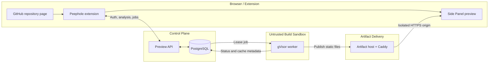

<p align="center">
  
</p>

<h1 align="center">Peephole</h1>

<p align="center">
  <strong>Preview a GitHub repository before you clone it.</strong>
</p>

<p align="center">
  <a href="https://chromewebstore.google.com/detail/peephole/fieofkhijgngfoflgpkbghbkaidhdgel">Install Peephole 0.1.0 from the Chrome Web Store</a>
</p>

<p align="center">
  Peephole analyzes supported public repositories, builds eligible static frontends in an isolated production sandbox, and renders the HTTPS artifact in a Chrome Side Panel.
</p>

<p align="center">
  <a href="https://github.com/The-peephole/peephole/actions/workflows/ci.yml">
    
  </a>
</p>

<p align="center">
  
</p>

<p align="center">
  <em>Analyze the repository, build its exact commit in an isolated gVisor sandbox, and preview the result directly from GitHub.</em>
</p>

## Why Peephole?

Understanding a frontend repository often starts with cloning it, inspecting `package.json`, installing dependencies, finding the right command, and then discovering that it needs secrets, a backend, or unsupported tooling.

Peephole performs bounded repository analysis first. It identifies the framework, package manager, build plan, preview eligibility, and any blockers or warnings. Only repositories that satisfy the supported static-preview contract proceed to an isolated build; everything else remains analysis-only with a clear explanation.

## Features

| Capability | What Peephole does |
| --- | --- |
| Repository analysis | Detects framework, package manager, build plan, blockers, and warnings from known repository files. |
| Repository structure detection | Describes the repository's layout (single project, workspace, or multiple projects) and lists bounded project candidate paths, without selecting or building any of them. |
| Branch selection | Lets you pick any branch from a bounded list; the selection is resolved to its exact commit SHA before analysis. |
| Commit-pinned previews | Resolves and builds an exact Git commit instead of trusting a mutable branch tip. |
| Clear eligibility | Distinguishes previewable repositories from unsupported projects before execution. |
| GitHub identity | Uses GitHub App OAuth; the extension stores only a short-lived Peephole session. |
| GitHub-aware theme | Matches the current GitHub Light, Dark, Dark Dimmed, or compatible Primer semantic theme in both the repository action and Side Panel. |
| Isolated builds | Runs untrusted install and build work as a non-root user inside gVisor with resource and network controls. |
| Side Panel delivery | Publishes static output over an isolated HTTPS origin and embeds it in Chrome's Side Panel. |

## How it works

1. Open a public GitHub repository.
2. Open Peephole from the repository page.
3. Review the detected stack, build plan, blockers, and preview eligibility.
4. Connect GitHub and start a preview build when the repository is supported.
5. Peephole verifies and builds the exact commit inside an isolated gVisor sandbox.
6. The generated static app appears in the Side Panel over HTTPS.

## Architecture



The extension is a controller and presentation surface; repository source is executed only inside the untrusted build boundary. The server independently verifies repository identity, commit, and build eligibility before a job reaches the worker.

## Security model

**Supported does not mean trusted.** Peephole treats every repository and dependency lifecycle script as untrusted input.

- Repository source is never executed inside the extension.
- Preview jobs are pinned to an exact Git commit.
- Install and build commands run as a non-root user inside real gVisor.
- The guest root filesystem is read-only; the workspace has a loop-backed ext4 hard capacity.
- CPU, memory, process, temporary-storage, and wall-clock limits bound each job.
- Build networking is disabled, while install networking blocks private, link-local, metadata, host, and inter-job destinations.
- Preview artifacts are served from isolated origins without extension or control-plane privileges.
- Disk, network, and sandbox ownership is durably recorded and reconciled after crashes.

Implementation details and residual risks are documented in [Preview runtime](docs/PREVIEW_RUNTIME.md), [Sandbox disk security](docs/SANDBOX_DISK_SECURITY.md), and [Sandbox network security](docs/SANDBOX_NETWORK_SECURITY.md).

## Current verification

Peephole's static-preview production path runs on AWS EC2 Ubuntu and has been
exercised end to end through the Chrome extension. These are recorded
environment-specific validations; they are not re-established by a
documentation-only change.

| Validation | Recorded result |
| --- | --- |
| GitHub App authentication | OAuth, PKCE, signed state, allowed `chromiumapp.org` redirect, and Peephole session issuance verified end to end |
| Real gVisor sandbox regression | Passed on the production-like Linux host |
| Real gVisor golden path | Passed with real `npm ci` and Vite/esbuild |
| Artifact delivery | HTTPS publication and Chrome Side Panel embedding verified |
| Crash recovery | `SIGKILL`, systemd restart, queue recovery, and startup runsc/disk/network reconciliation verified |
| Final resource residue | No runsc containers, namespaces, veths, firewall rules, mounts, loop devices, leases, or job files remained |
| Cache invalidation | `runnerVersion: "production-2"` forced the expected fresh build after the runner security change |
| Portable CI | Format, lint, typecheck, portable tests, and extension build are enforced by CI |
| PostgreSQL integration | Passed |

Environment-gated real gVisor tests are run separately on the production-like Linux host; they are intentionally not part of portable CI.

On `main`, the manually dispatched
[`Real golden-path build tests`](https://github.com/The-peephole/peephole/actions/runs/35069679620)
workflow succeeded at merge commit
`dba47191bdd3600b3f451945653efab2363028c2` using the current first-party
fixture. That workflow is live-network CI, not the operator-run production
smoke described in [Production smoke verification](docs/PRODUCTION_SMOKE.md).

## Supported projects

| Level | Current scope |
| --- | --- |
| Production execution | Static HTML; root-level Vite + React using npm and a root `package-lock.json` |
| Analysis recognition only | Vue/Svelte Vite, other package managers, backend hints, and monorepo ambiguity; these do not produce runnable plans |
| Existing deployment handling | Displays a normalized GitHub repository-homepage link in a new tab; embedded deployed-site Live Preview is not implemented |
| Branch selection | Any branch from a bounded (up to 100) list can be selected; it is resolved to an exact commit SHA before analysis, build plan, and preview job creation |
| Repository structure detection | Reports layout and bounded project-candidate paths (e.g. `frontend`, `apps/web`) for read-only display; no candidate can be selected or built |
| Not implemented | Frontend target selection, full-stack execution/routing, secret injection, temporary databases, private repositories, and arbitrary Dockerfiles/languages |

Analysis support is broader than production execution support. The official
Vite + React golden path is
[`The-peephole/peephole-fixture-vite-react`](https://github.com/The-peephole/peephole-fixture-vite-react)
at commit `4a2c3b78e15d90865ed565c3d38c4045b5a5235f` (repository id
`1371620276`). The separate
[`peephole-fixture-fullstack`](https://github.com/The-peephole/peephole-fixture-fullstack)
at `eae411a288b212201933cebb206126dd5bb0d93e` is a future roadmap fixture,
not a supported capability, though repository structure detection now
verifies against its `frontend`/`backend` layout as a detection-only target.

## Local development

Install dependencies with Node.js 24 and npm:

```bash
npm ci
```

Copy `.env.example` to `.env.local`, provide a local `PEEPHOLE_DATABASE_URL`, and point `WXT_PREVIEW_API_BASE_URL` to `http://127.0.0.1:8787`. Never put credentials or server secrets in a `WXT_` variable because those values are bundled into the extension.

| Command | Purpose |
| --- | --- |
| `npm run dev` | Start WXT extension development mode |
| `npm run dev:preview-server` | Start the local Preview API and worker loop |
| `npm test` | Run the portable Vitest suite |
| `npm run typecheck` | Generate WXT types and run TypeScript checks |
| `npm run lint` | Run ESLint |
| `npm run build` | Build the Chrome extension |

The local preview worker is deliberately unsandboxed and must only build source you already trust. Production isolation requires Linux and gVisor; see [Preview runtime](docs/PREVIEW_RUNTIME.md) for the distinction.

## Project status

The production static-preview foundation, GitHub theme synchronization,
Branch Preview, repository/application structure detection, and the explicit
Build Adapter architecture are implemented. Build Adapter generalization
preserves the deliberately narrow runner capability; it does not add framework
or package-manager support. Product expansion continues in this order:

4. Build Adapter generalization (implemented)
5. frontend target selection / frontend monorepo support
6. existing deployed-site Live Preview
7. backend detection
8. backend execution
9. frontend ↔ backend routing
10. ephemeral env / secrets
11. temporary database support

The full-stack stages are roadmap items, not current product support. Separate
operational debt includes accessibility review, production observability,
automated production-smoke orchestration, tighter install-stage package egress,
and the production-like malicious-script run.

## Documentation

- [Product specification](docs/PRODUCT_SPEC.md)
- [Architecture](docs/ARCHITECTURE.md)
- [Preview runtime](docs/PREVIEW_RUNTIME.md)
- [Repository analysis specification](docs/REPOSITORY_ANALYSIS.md)
- [GitHub App authentication](docs/GITHUB_APP_AUTH.md)
- [Privacy policy](PRIVACY.md)
- [Chrome Web Store listing and release operations](docs/CHROME_WEB_STORE.md)
- [v0.1.0 release record and remaining checks](docs/RELEASE_V0.1.0.md)
- [Requester IP trust](docs/REQUESTER_IP_TRUST.md)
- [Sandbox disk security](docs/SANDBOX_DISK_SECURITY.md)
- [Sandbox network security](docs/SANDBOX_NETWORK_SECURITY.md)
- [MVP roadmap](docs/MVP_ROADMAP.md)
- [Implementation checklist](docs/IMPLEMENTATION_CHECKLIST.md)
- [Test plan](docs/TEST_PLAN.md)
- [Technical decisions](docs/DECISIONS.md)

---

Peephole prefers inspection before execution. When execution is necessary, it treats the repository as hostile and runs it outside the browser extension in a short-lived sandbox.
