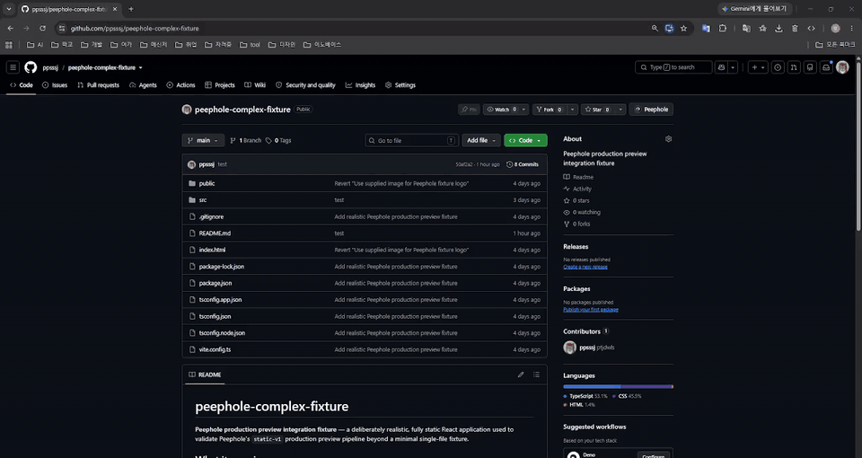
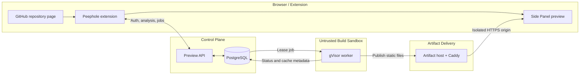

<p align="center">
  
</p>

<h1 align="center">Peephole</h1>

<p align="center">
  <strong>Preview a GitHub repository before you clone it.</strong>
</p>

<p align="center">
  Peephole analyzes supported public repositories, builds eligible static frontends in an isolated production sandbox, and renders the HTTPS artifact in a Chrome Side Panel.
</p>

<p align="center">
  <a href="https://github.com/The-peephole/peephole/actions/workflows/ci.yml">
    
  </a>
</p>

<p align="center">
  
</p>

<p align="center">
  <em>Analyze the repository, build its exact commit in an isolated gVisor sandbox, and preview the result directly from GitHub.</em>
</p>

## Why Peephole?

Understanding a frontend repository often starts with cloning it, inspecting `package.json`, installing dependencies, finding the right command, and then discovering that it needs secrets, a backend, or unsupported tooling.

Peephole performs bounded repository analysis first. It identifies the framework, package manager, build plan, preview eligibility, and any blockers or warnings. Only repositories that satisfy the supported static-preview contract proceed to an isolated build; everything else remains analysis-only with a clear explanation.

## Features

| Capability | What Peephole does |
| --- | --- |
| Repository analysis | Detects framework, package manager, build plan, blockers, and warnings from known repository files. |
| Commit-pinned previews | Resolves and builds an exact Git commit instead of trusting a mutable branch tip. |
| Clear eligibility | Distinguishes previewable repositories from unsupported projects before execution. |
| GitHub identity | Uses GitHub App OAuth; the extension stores only a short-lived Peephole session. |
| Isolated builds | Runs untrusted install and build work as a non-root user inside gVisor with resource and network controls. |
| Side Panel delivery | Publishes static output over an isolated HTTPS origin and embeds it in Chrome's Side Panel. |

## How it works

1. Open a public GitHub repository.
2. Open Peephole from the repository page.
3. Review the detected stack, build plan, blockers, and preview eligibility.
4. Connect GitHub and start a preview build when the repository is supported.
5. Peephole verifies and builds the exact commit inside an isolated gVisor sandbox.
6. The generated static app appears in the Side Panel over HTTPS.

## Architecture



The extension is a controller and presentation surface; repository source is executed only inside the untrusted build boundary. The server independently verifies repository identity, commit, and build eligibility before a job reaches the worker.

## Security model

**Supported does not mean trusted.** Peephole treats every repository and dependency lifecycle script as untrusted input.

- Repository source is never executed inside the extension.
- Preview jobs are pinned to an exact Git commit.
- Install and build commands run as a non-root user inside real gVisor.
- The guest root filesystem is read-only; the workspace has a loop-backed ext4 hard capacity.
- CPU, memory, process, temporary-storage, and wall-clock limits bound each job.
- Build networking is disabled, while install networking blocks private, link-local, metadata, host, and inter-job destinations.
- Preview artifacts are served from isolated origins without extension or control-plane privileges.
- Disk, network, and sandbox ownership is durably recorded and reconciled after crashes.

Implementation details and residual risks are documented in [Preview runtime](docs/PREVIEW_RUNTIME.md), [Sandbox disk security](docs/SANDBOX_DISK_SECURITY.md), and [Sandbox network security](docs/SANDBOX_NETWORK_SECURITY.md).

## Production verification

Peephole's current production path runs on AWS EC2 Ubuntu and has been exercised end to end through the Chrome extension.

| Validation | Recorded result |
| --- | --- |
| GitHub App authentication | OAuth, PKCE, signed state, allowed `chromiumapp.org` redirect, and Peephole session issuance verified end to end |
| Real gVisor sandbox regression | 15/15 passed |
| Real gVisor golden path | 1/1 passed, including real `npm ci` and Vite/esbuild |
| Artifact delivery | HTTPS publication and Chrome Side Panel embedding verified |
| Crash recovery | `SIGKILL`, systemd restart, queue recovery, and startup runsc/disk/network reconciliation verified |
| Final resource residue | No runsc containers, namespaces, veths, firewall rules, mounts, loop devices, leases, or job files remained |
| Cache invalidation | `runnerVersion: "production-2"` forced the expected fresh build after the runner security change |
| Portable CI | 585 passed; 31 environment-gated tests skipped |
| PostgreSQL integration | Passed |

The latest normal production smoke produced a fresh cache miss with `status=ready` and `error_code=null`; a follow-up request hit the cache, and the artifact returned HTTP 200. Format, lint, typecheck, and extension build checks also pass.

Environment-gated real gVisor tests are run separately on the production-like Linux host; they are intentionally not part of portable CI.

## Supported projects

| Level | Current scope |
| --- | --- |
| Production verified | Static HTML; root-level Vite + React using npm |
| Analyzer and product scope | React, Vue, and Svelte static frontend contracts |
| Pending equivalent production validation | Vue and Svelte golden-path and security coverage |
| Out of scope for v0.1 | Private repositories, backend/database provisioning, persistent SSR or Node servers, arbitrary Dockerfiles/languages, and user-provided secrets |

Analysis support is broader than production execution support. Vue and Svelte are not yet described as production-verified.

## Local development

Install dependencies with Node.js 24 and npm:

```bash
npm ci
```

Copy `.env.example` to `.env.local`, provide a local `PEEPHOLE_DATABASE_URL`, and point `WXT_PREVIEW_API_BASE_URL` to `http://127.0.0.1:8787`. Never put credentials or server secrets in a `WXT_` variable because those values are bundled into the extension.

| Command | Purpose |
| --- | --- |
| `npm run dev` | Start WXT extension development mode |
| `npm run dev:preview-server` | Start the local Preview API and worker loop |
| `npm test` | Run the portable Vitest suite |
| `npm run typecheck` | Generate WXT types and run TypeScript checks |
| `npm run lint` | Run ESLint |
| `npm run build` | Build the Chrome extension |

The local preview worker is deliberately unsandboxed and must only build source you already trust. Production isolation requires Linux and gVisor; see [Preview runtime](docs/PREVIEW_RUNTIME.md) for the distinction.

## Project status

Milestones 0–6 are complete for the current public static-preview production path. Milestone 7—release and operations—is in progress.

Remaining v0.1 work includes:

- accessibility review;
- automated production smoke and release checks;
- production metrics, log aggregation, and alerts;
- authenticated package proxying for tighter install-stage egress;
- equivalent Vue and Svelte production validation;
- the dedicated `realGvisorMaliciousScript` suite on the AWS gVisor host;
- Chrome Web Store and v0.1 release preparation.

Post-v0.1 candidates include private repository support, refreshable Peephole sessions, and broader framework/runtime support.

## Documentation

- [Product specification](docs/PRODUCT_SPEC.md)
- [Architecture](docs/ARCHITECTURE.md)
- [Preview runtime](docs/PREVIEW_RUNTIME.md)
- [Repository analysis specification](docs/REPOSITORY_ANALYSIS.md)
- [GitHub App authentication](docs/GITHUB_APP_AUTH.md)
- [Requester IP trust](docs/REQUESTER_IP_TRUST.md)
- [Sandbox disk security](docs/SANDBOX_DISK_SECURITY.md)
- [Sandbox network security](docs/SANDBOX_NETWORK_SECURITY.md)
- [MVP roadmap](docs/MVP_ROADMAP.md)
- [Implementation checklist](docs/IMPLEMENTATION_CHECKLIST.md)
- [Test plan](docs/TEST_PLAN.md)
- [Technical decisions](docs/DECISIONS.md)

---

Peephole prefers inspection before execution. When execution is necessary, it treats the repository as hostile and runs it outside the browser extension in a short-lived sandbox.
